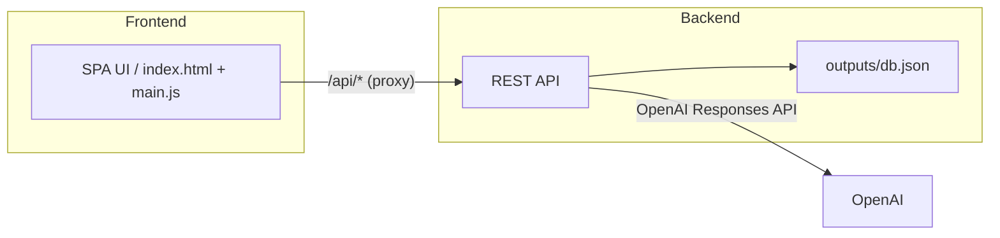

# UML ↔ Code Studio

요구사항(텍스트)·소스코드·Mermaid 다이어그램을 **상호 변환**하고, 결과를 **로컬 JSON DB**(`./outputs/db.json`)에 저장하는 풀스택 데모입니다.  
프론트엔드는 Vite 개발 서버, 백엔드는 Express(ESM)로 동작합니다.

> **핵심 콘셉트**
> - **요구사항 → Mermaid**
> - **소스코드 → Mermaid**
> - **Mermaid → 소스코드**
> - DB 탭에서 요구사항/코드/다이어그램 조회·저장

---

## 1) 아키텍처 개요



- 프론트엔드 개발 서버가 **`/api/*` 요청을 백엔드로 프록시**합니다.
- 백엔드는 변환/CRUD API를 제공하고, 데이터를 **`./outputs/db.json`**에 저장합니다.

---

## 2) 디렉터리(업로드 기준)

```
.
├─ index.html
├─ main.js                # SPA 로직(탭, 프리뷰, API호출 등)
├─ server.mjs             # Express 백엔드(API/저장/변환)
├─ vite.config.js         # /api → 백엔드 프록시 설정
└─ outputs/               # (실행 시 생성) db.json 저장 위치
```

---

## 3) 요구 사항

- Node.js 18+ 권장
- OpenAI API Key (환경변수 `OPENAI_API_KEY`)

---

## 4) 설치

```bash
npm install
```

```bash
# (참고) 의존성 패키지 설치
npm i 
```

---

## 5) 환경 변수(.env)

루트에 `.env` 파일을 만들고 다음을 채웁니다.

```ini
# 백엔드(Express) 포트
API_PORT=3100

# OpenAI
OPENAI_API_KEY=sk-...
# MODEL_ID=gpt-4o-mini     # (선택) 기본값 gpt-4o-mini
```

> 코드의 기본 포트는 `3000`이지만, `.env`의 `API_PORT`가 **우선** 적용됩니다.  
> 팀 규칙을 3100으로 고정하고 싶다면 fallback도 3100으로 바꾸세요(선택).

---

## 6) 실행(개발 모드)

동시에 프론트·백엔드를 띄우는 스크립트가 정의되어 있다면(예: `npm run all`) 이를 사용하세요.
아래는 일반적인 예시입니다.

```bash
# (동시 기동)
npm run all

# 또는 터미널 2개를 열어서 각각
npm run server   # → [server] listening on http://localhost:3100
npm run dev      # → VITE v5 ... ➜ Local: http://localhost:5173/
```

실행 후 브라우저에서 **http://localhost:5173** 접속.

### 프록시 동작
- Vite 개발 서버가 `.env`의 `API_PORT`를 읽어 **`/api` → `http://localhost:${API_PORT}`** 로 프록시합니다.
- 지금 구성에선 `.env`가 `API_PORT=3100`이면 프론트에서 `/api/*` 호출 시 백엔드 **3100**으로 전달됩니다.

---

## 7) 주요 기능 & 사용법

### (1) 요구사항 → Mermaid
- 좌측 폼에 요구사항/메타를 입력하고 “변환”을 누르면 결과 영역에 Mermaid가 생성됩니다.
- **결과 영역 텍스트를 수정하면** 하단 미리보기(동일 카드 내 `*-view`)가 **실시간 반영**됩니다.
- “저장”을 누르면 DB(`outputs/db.json`)에 요구사항 및 다이어그램이 저장됩니다.

### (2) 소스코드 → Mermaid
- 언어/코드 입력 → “변환” → 결과 Mermaid 확인.
- **결과 영역을 수정하면** 하단 미리보기가 **실시간 반영**됩니다.
- “저장”을 누르면 코드/다이어그램을 DB에 저장합니다.

### (3) Mermaid → 소스코드
- Mermaid 입력 후 “변환”을 누르면 **코드**가 생성됩니다.
- 이 탭은 **미리보기가 없습니다**.

### (4) 데이터베이스 탭
- 저장된 요구사항/코드/다이어그램 목록을 조회할 수 있습니다.
- 다이어그램 항목은 “펼치기” 시 미니 썸네일이 즉시 렌더됩니다.

---

## 8) API 요약

> 베이스 URL: `http://localhost:${API_PORT}`

- **목록**
  - `GET /api/list/req`
  - `GET /api/list/code`
  - `GET /api/list/diagram`
- **조회**
  - `GET /api/get/req/:id`
  - `GET /api/get/code/:codeId`
  - `GET /api/get/diagram/:diagramId`
- **저장**
  - `POST /api/save/req`
  - `POST /api/save/code`
  - `POST /api/save/diagram`
- **변환**
  - `POST /api/convert/req2mm` (요구사항 → Mermaid)
  - `POST /api/convert/code2mm` (코드 → Mermaid)
  - `POST /api/convert/mm2code` (Mermaid → 코드)

> 응답/입력 스키마는 코드 주석과 폼 직렬화 로직을 참고하세요.  
> DB 파일은 `./outputs/db.json`에 저장되며, 없는 경우 실행 시 생성됩니다.

---

## 9) 포트/프록시 가이드 (3000 ↔ 3100)

- 현재 구성
  - 프론트: **5173** (Vite)
  - 백엔드: **API_PORT** (기본 3000, `.env`로 3100 설정 가능)
- Vite 프록시는 `.env`의 `API_PORT`를 읽어 `/api`를 해당 포트로 전달합니다.

> **정리 팁**
> - 실행은 이미 `.env`로 제어되므로 숫자 “3000”이 남아 있어도 동작엔 영향 없습니다(기본값일 뿐).
> - 혼동을 줄이려면 주석을 `API_PORT` 기준으로 정리하거나, 기본값을 3100으로 통일하세요(선택).

---

## 10) 문제 해결(트러블슈팅)

- **UI가 아예 안 뜬다**
  - `index.html` 스크립트 경로 확인: `"/src/main.js"` ↔ 실제 파일 위치 일치 여부.
- **프록시 에러/백엔드 접속 실패**
  - `.env`의 `API_PORT` 확인, 프론트/백엔드 **재시작**.
  - 개발자도구 네트워크 탭에서 `/api/*` 요청의 대상 포트가 3100인지 확인.
- **OpenAI 에러/빈 응답**
  - `OPENAI_API_KEY` 설정 확인, 모델 한도/권한 확인.
- **Mermaid 미리보기 미반영**
  - 결과 영역 textarea에 입력/붙여넣기 시 하단 `*-view` 박스가 갱신되는지 확인.
  - Mermaid 코드블록 ```mermaid fence 제거/정리 로직이 포함되어 있으니 원본에 fence를 중복으로 넣지 말 것.
- **권한/보안**
  - 데모 편의상 CORS가 널널히 열려 있습니다. 운영 시 화이트리스트로 제한하세요.
  - 운영 환경에선 CORS/로깅/에러 핸들링/보안 헤더 강화 필요합니다.


